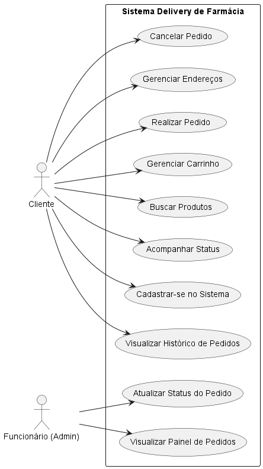

# 💊 Farmácia Delivery 


Um sistema web completo de e-commerce e gestão de pedidos para farmácias. Este projeto funciona como um MVP (Minimum Viable Product) e foi projetado com uma arquitetura moderna, separando a experiência do cliente final do painel de controle administrativo.

## ✨ Funcionalidades

O sistema é dividido em duas grandes áreas (Rotas separadas no Next.js):

### 🛒 Área do Cliente (`/`)
* **Catálogo de Produtos:** Listagem de medicamentos e itens de farmácia com filtros de categoria (Dor e Febre, Gripe, Higiene, etc).
* **Carrinho de Compras Avançado:** Sistema de carrinho em etapas (Stepper) com resumo de valores, controle de quantidade e formulário de entrega.
* **Histórico de Pedidos:** Tabela responsiva (Grid Layout) com o status de pedidos anteriores do cliente.
* **Autenticação (Mock):** Tela de login moderna com alternância entre perfis (Cliente vs Funcionário) usando `localStorage` para gerenciar a sessão ativa no cabeçalho.

### 💼 Painel Administrativo (`/pedidos` & `/dashboard`)
* **Sistema Kanban de Pedidos:** Interface visual e interativa para acompanhamento do fluxo logístico, com colunas para: *Novos Pedidos*, *Preparando*, *Saiu para Entrega* e *Entregue*.
* **Layout Dashboard:** Menu lateral (Sidebar) fixo para navegação rápida e área de trabalho espaçosa, otimizada para uso em computadores de balcão.
* **Modo de Visão Limpa:** Design focado na leitura rápida dos itens do pedido para acelerar a separação no estoque.

## 🚀 Tecnologias Utilizadas

* **Framework Principal:** [Next.js](https://nextjs.org/) (App Router).
* **Biblioteca de Interface:** [React](https://reactjs.org/).
* **Linguagem:** [TypeScript](https://www.typescriptlang.org/) (tipagem estática para maior segurança).
* **Estilização:** *CSS Modules* (escopo fechado e componentização).
* **Ícones:** [Lucide React](https://lucide.dev/) (ícones vetoriais modernos).
* **Gráficos e Dashboards:** [Recharts](https://recharts.org/) (visualização de dados no painel administrativo).

## 🎨 Planejamento Visual e Funcional

### Prototipação (Baixa Fidelidade)
Esboço inicial da interface, focado na disposição dos elementos e fluxo de navegação.

[](https://www.figma.com/proto/XKzc8QdniHfRaDnHFNal0r/Prot%C3%B3tipo-Sistema-Delivery-de-Farm%C3%A1cia?node-id=1-2&p=f&t=R0JCD5BARSK5lrAj-1&scaling=scale-down&content-scaling=fixed&page-id=0%3A1&starting-point-node-id=1%3A2)

### Diagrama de Caso de Uso
Interações dos atores (Cliente/Administrador) com as funcionalidades centrais do sistema.



## 💻 Pré-requisitos

Antes de começar, verifique se você atendeu aos seguintes requisitos:

Você instalou a versão estável mais recente do Node.js e NPM.

Você tem uma máquina Windows, Linux ou Mac.

## 🚀 Instalando Farmácia Delivery 
Para instalar o Farmácia Delivery , siga estas etapas:

Linux, macOS e Windows:

```Bash
### Clone o repositório
git clone https://github.com/joaovitor-9/Delivery_Farmacia.git

### Acesse a pasta
cd Delivery_Farmacia

### Instale as dependências
npm install

### Inicie o servidor
npm run dev

Acesse http://localhost:3000 no seu navegador para ver o resultado.
```
## 🔐 Acesso ao Sistema

### 🛒 Área do Cliente
Para simular o login do cliente:
* **Usuário:** cliente@gmail.com
* **Senha:** 123

### 💼 Painel Administrativo
Para simular o login do funcionário:
* **Usuário:** admin
* **Senha:** 123

## 🤝 Colaboradores

* [Elias Manuel Fonseca Moreira](https://github.com/elias445) - Desenvolvedor
* [João Vitor Farias de Amorim](https://github.com/joaovitor-9) - Desenvolvedor


